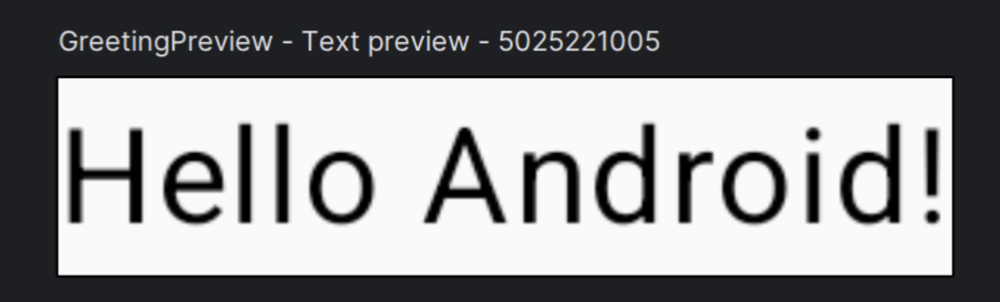
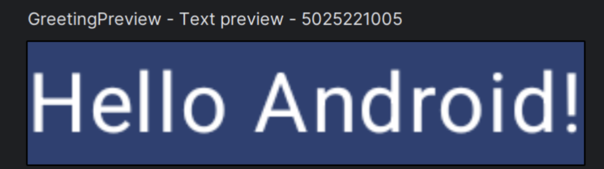
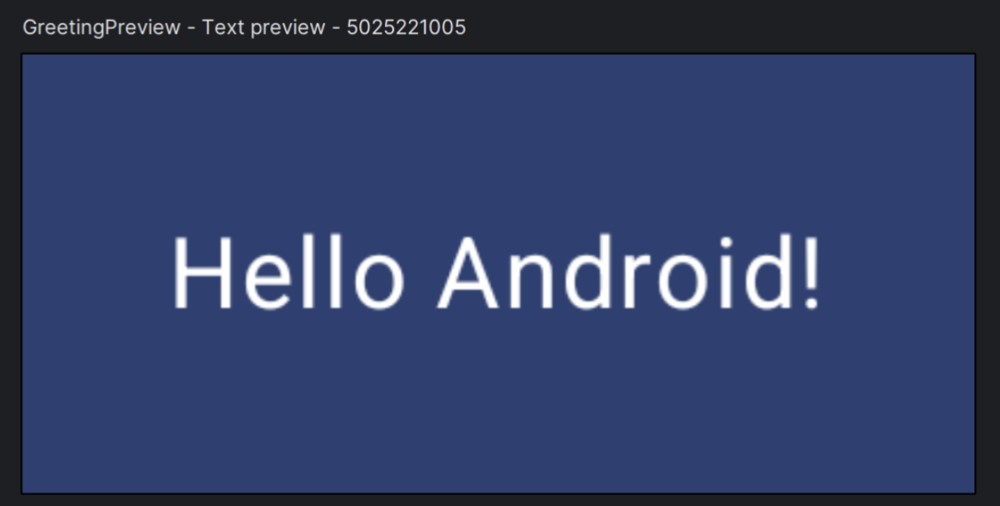
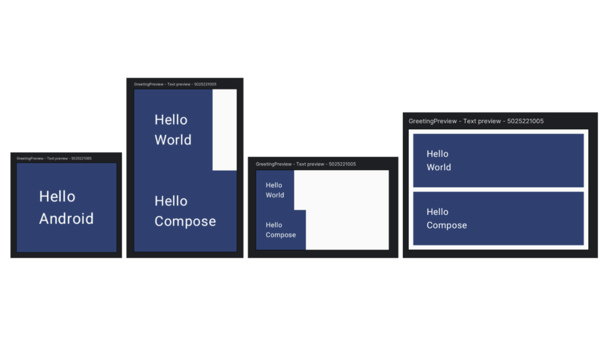
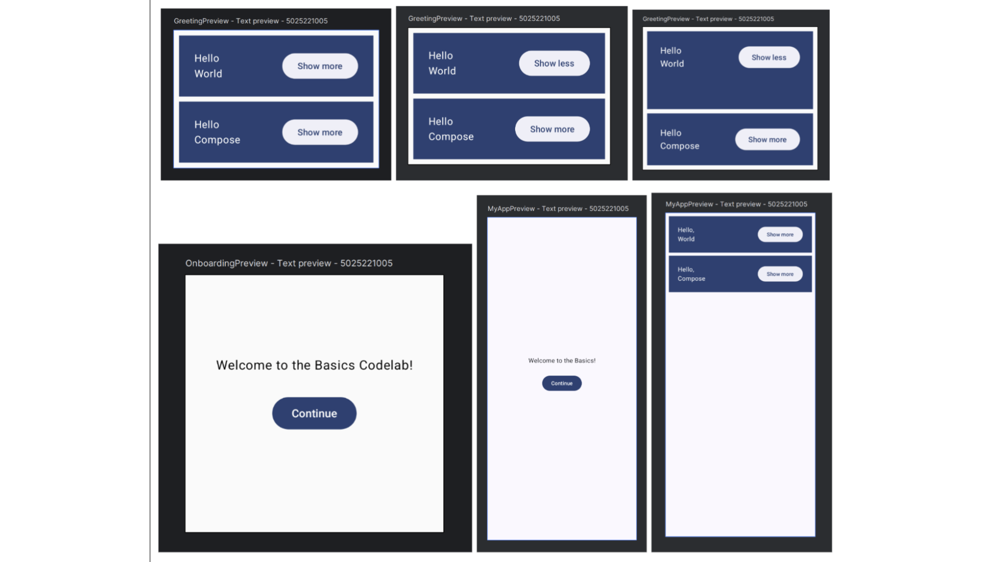
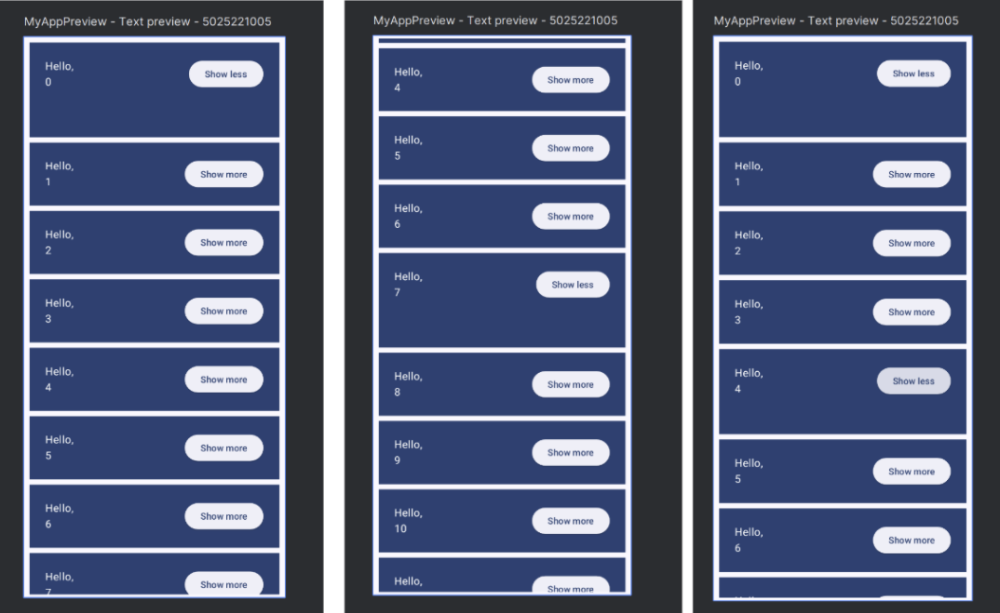
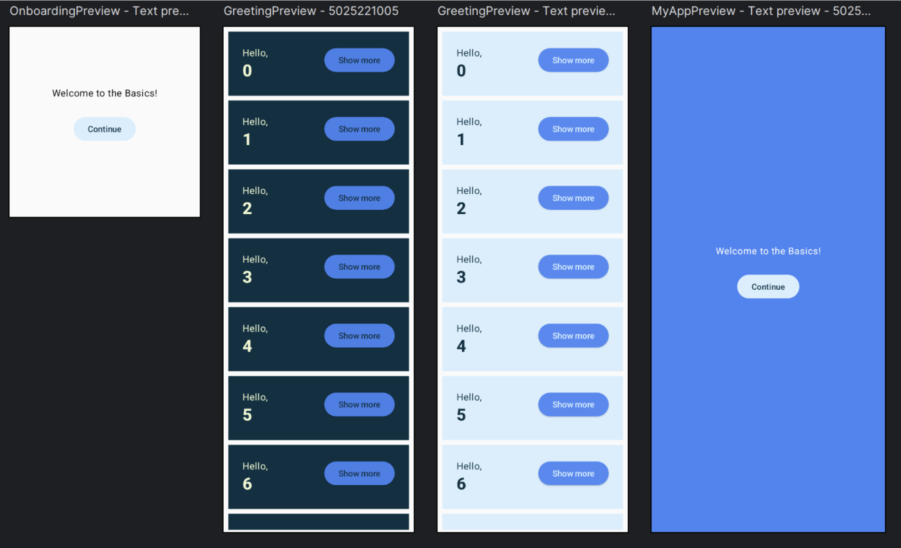
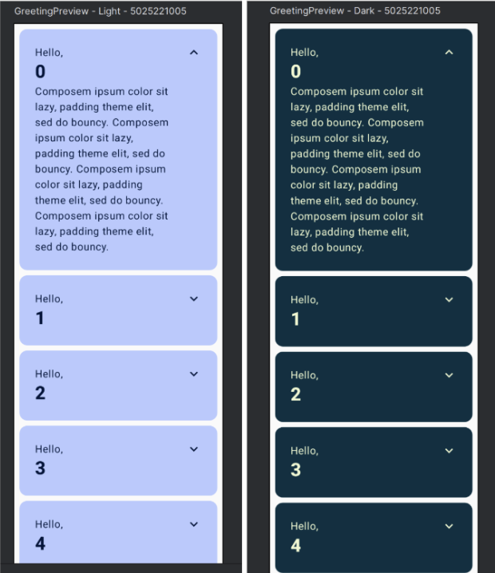

# Jetpack Compose Guide

**Nama:** Nabilah Atika Rahma  
**NRP:** 5025221005  
**Kelas:** PPB G - Week 2

## Starting a New Compose Project

Project Compose baru dimulai dengan memilih **Empty Activity** dari template.

## Getting Started with Compose

Jetpack Compose adalah framework deklaratif untuk membangun UI di Android menggunakan Kotlin, ditandai dengan anotasi `@Composable` yang berguna untuk menyusun tampilan secara hierarkis.

Dalam aplikasi Android berbasis Compose, **Activity tetap menjadi entry point**, di mana layout didefinisikan menggunakan `setContent` tanpa file XML, melainkan langsung memanggil fungsi `@Composable`. Selain itu, untuk melihat tampilan tanpa menjalankan aplikasi, **Android Studio menyediakan fitur preview** dengan anotasi `@Preview`, yang memungkinkan pengembang melihat hasil komponen UI langsung di editor.

---

## Simple Customize UI

Untuk mengubah background pada **Greeting**, gunakan `Surface` dan atur warnanya dengan `MaterialTheme.colorScheme.primary`.

## Modifiers

**Modifiers** dalam Jetpack Compose digunakan untuk **mengatur tata letak, tampilan, dan perilaku** elemen UI dalam parent layout-nya.

---

## Reusing Compose

Semakin banyak komponen yang ditambahkan ke UI, semakin kompleks hierarki yang terbentuk. **Memecah fungsi menjadi komponen kecil dan modular** akan lebih efektif, mengurangi duplikasi kode, dan membuat struktur kode lebih rapi.

## Creating Columns and Rows

Dalam Jetpack Compose, tersedia tata letak dasar:
- **Column** untuk menyusun elemen secara vertikal
- **Row** untuk menyusun elemen secara horizontal
- **Box** untuk menumpuk elemen

Selain itu, fungsi `@Composable` dalam Jetpack Compose dapat digunakan seperti fungsi Kotlin biasa, sehingga dapat menggunakan looping `for`.

---

## Adding a Button and State

Untuk menambahkan tombol, gunakan **ElevatedButton** dari **Material3**. Sedangkan untuk menambahkan interaksi, kita perlu menyimpan status menggunakan **State dan MutableState**.
Untuk **state hoisting**, pindahkan state ke tingkat lebih tinggi agar bisa digunakan oleh beberapa composable.

---

## Performant Lazy List, Persisting State, and Animating List

Penggunaan **LazyColumn** bertujuan untuk menampilkan daftar secara efisien karena hanya **merender item yang terlihat di layar**, berbeda dengan RecyclerView yang melakukan recycling.
Namun, **state onboarding tidak bertahan** saat rotasi atau perubahan konfigurasi. **Gunakan `rememberSaveable`** untuk menyimpan state meskipun terjadi perubahan konfigurasi.
Untuk animasi, gunakan `animateDpAsState`.

---

## Styling and Theming Your App

Jetpack Compose dapat menggunakan **MaterialTheme** untuk menetapkan warna, tipografi, dan bentuk secara konsisten.

- Warna khusus didefinisikan di **Color.kt**
- **SideEffect** mengatur warna status bar agar selaras dengan tema

---

## Finishing

Untuk penyempurnaan, lakukan beberapa hal berikut:
- Ganti tombol dengan **IconButton** dan **Icon** untuk tampilan lebih intuitif.
- Atur **padding** agar optimal.
- Gunakan **stringResource** dari `strings.xml` untuk aksesibilitas.
- Terapkan **animasi ekspansi teks** dengan `animateContentSize`.
- Gunakan **Card dengan `CardDefaults.cardColors`** untuk tampilan lebih estetis.

Dengan implementasi ini, aplikasi Jetpack Compose akan lebih **modular, efisien, dan menarik** bagi pengguna.

---

### 🚀 Happy Coding with Jetpack Compose! 🎉
